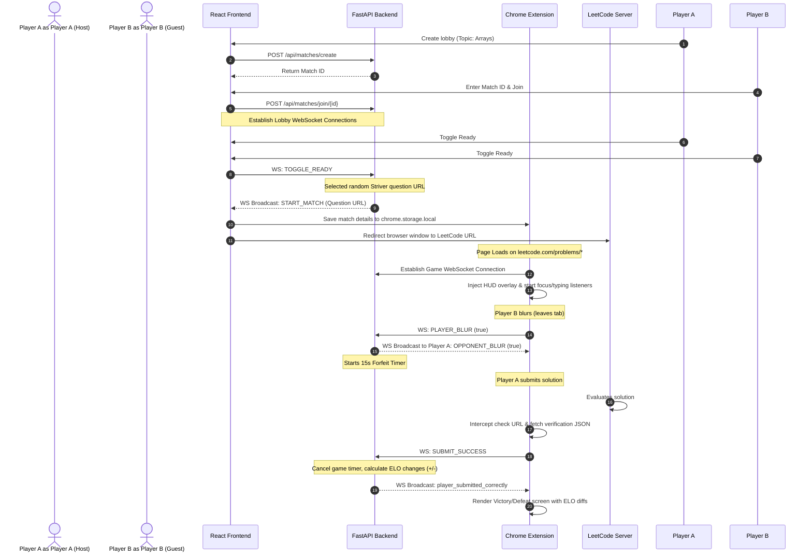

# LeetRace 🏁

LeetRace is a real-time, competitive 1v1 LeetCode racing platform. Players can create or join lobbies based on specific topics (from Striver's DSA Sheet), launch head-to-head races on LeetCode, track each other's live progress, trigger sabotages, and climb the global ELO leaderboard.

The project consists of three main components:
1. **FastAPI Backend**: Manages user authentication, match sessions, WebSocket game loops, ELO calculations, and DB state.
2. **React Frontend**: The hub for registration/login, viewing the ELO leaderboard, managing lobbies, and connecting to matches.
3. **Chrome Extension (Manifest V3)**: Injects a HUD onto the LeetCode problem page, tracks tab focus and typing, executes sabotages (like screen blur/flashbangs), and automatically intercepts solution submissions to claim victory.

---

## 🏗️ Architecture & Component Flow

The flow of a LeetRace match from creation to completion is illustrated below:



### Detailed Flow Steps:

1. **Authentication & Matchmaking**:
   - Users authenticate (login/register) through the React App.
   - Hosts select a Striver topic (e.g., Arrays, Linked Lists, Graphs) and click **Create Lobby**, generating a unique Match ID.
   - Guests enter the Match ID to join the room.
   - Both players toggle **Ready** on the lobby interface. This status is synchronized via WebSockets (`ws://<API_HOST>/ws/match/{match_id}`).
   
2. **Match Initialization & Transition**:
   - Once both players are ready, the backend picks a random problem mapped to the selected topic, sets the match status to `ACTIVE`, and sends a `START_MATCH` payload to both clients.
   - The React page communicates with the Chrome extension internally (`chrome.runtime.sendMessage`), caching the active match context (IDs, WS token, targets) in the extension's `chrome.storage.local`.
   - The React app automatically redirects the player directly to the selected LeetCode problem URL.

3. **Active Race HUD & Interceptions (On LeetCode)**:
   - When the LeetCode page loads, the extension's content script matches the target URL and establishes a game-specific WebSocket connection.
   - An overlay HUD is injected at the bottom-right of the LeetCode interface. It displays the 15-minute match timer, opponent status, and active sabotage abilities.
   - **Draggable HUD**: The HUD can be grabbed and dragged anywhere on the screen by the user to avoid covering elements.
   - **Focus / Blur Tracking (Anti-Cheat)**: If a user leaves the LeetCode tab (e.g., searches for answers), a focus listener triggers a websocket message. The backend alerts the opponent and counts down a 15-second forfeit timer. Focus must be returned within 15 seconds to prevent forfeiture.
   - **Typing Indicator**: Keydown events inside LeetCode's Monaco code editor trigger typing status updates, showing a "Writing code..." notification on the opponent's HUD.
   - **Sabotage (Flashbang)**: Players can click the "Flashbang" button. The backend relays the sabotage event, prompting the opponent's screen to flash solid white and blur out (`filter: blur(12px)`) for 5 seconds.
   - **Submission Interception**: When a submission check is triggered on LeetCode, the extension's background script intercepts the HTTP request, performs a parallel out-of-band request using the user's cookies to get the verdict, and notifies the content script.
   - **Victory & ELO Updates**: If the submission is verified as "Accepted", the content script notifies the backend. The backend updates the databases, computes the new ELO ratings (using a K-factor of 32), and signals the game over. The content script renders a full-screen overlay showing Victory/Defeat, time taken, and ELO changes.

---

## 📁 File Structure

```bash
LeetRace/
├── backend/                  # FastAPI Web Server & Game Loops
│   ├── auth.py               # Token generation/verification and password hashing (bcrypt)
│   ├── database.py           # SQLAlchemy database configuration and session manager
│   ├── main.py               # REST endpoints, CORS middleware, & WS endpoint routing
│   ├── manager.py            # MatchSession data structure and WebSocket ConnectionManager
│   ├── models.py             # Database models (User, Question, Match)
│   ├── schemas.py            # Pydantic validation schemas
│   ├── seed.py               # Questions seeder script containing Striver topic problems
│   └── requirements.txt      # Python backend packages
│
├── extension/                # Chrome Extension (Helper tool)
│   ├── manifest.json         # Manifest V3 extension configuration & permissions
│   ├── background.js         # Intercepts LeetCode evaluation requests & handles external messages
│   ├── content.js            # Injects HUD/Game overlays, handles focus/typing, & WS messaging
│   └── register.js           # Auto-registers the extension ID to the React app automatically
│
└── frontend/                 # React Frontend (Vite build)
    ├── vite.config.js        # Vite compilation configurations
    ├── package.json          # Node dependencies
    ├── index.html            # Main HTML layout
    └── src/
        ├── main.jsx          # React initialization mount point
        ├── App.jsx           # Single-page client app (Auth, Lobby, Leaderboard UI)
        └── index.css         # Styling directives and custom visual effects
```

---

## ⚙️ Configuration & Environment Setup

### 1. Database & Environment Setup
Create a `.env` file in the root directory of the project:
```env
DATABASE_URL=mysql+pymysql://<user>:<password>@localhost:3306/leetrace
SECRET_KEY=SUPER_SECRET_LEETRACE_KEY_123456789
```

### 2. Backend Installation & Setup
Initialize a virtual environment and install dependencies:
```bash
# From the root directory
python3 -m venv .venv
source .venv/bin/activate
pip install -r backend/requirements.txt
```

Seed the Striver questions database:
```bash
# From the root directory
PYTHONPATH=. python backend/seed.py
```

Run the FastAPI backend:
```bash
# Run FastAPI with uvicorn reload
PYTHONPATH=. uvicorn backend.main:app --host 0.0.0.0 --port 8000 --reload
```

### 3. Frontend Installation & Setup
Move into the `frontend` folder, install Node packages, and run the Vite dev server:
```bash
cd frontend
npm install
npm run dev
```
By default, the Vite dev server will run on `http://localhost:3000`.

### 4. Chrome Extension Installation
To load the extension locally in Google Chrome:
1. Open Chrome and navigate to `chrome://extensions/`.
2. Enable **Developer mode** (toggle switch on the top right).
3. Click **Load unpacked** (button on the top left).
4. Select the `extension/` directory of this project.
5. **Auto-registration is enabled**: There is no need to manually copy-paste the extension ID or run commands in the console. The extension will automatically expose its ID to the web app.

---

## 🛡️ Anti-Cheat & Safeguards

- **Tab Blur Forfeiture**: Tracked using window events. Focus shifts trigger a 15-second forfeit sequence to prevent players from copy-pasting code or searching answers off-screen.
- **Problem Sync Checking**: The content script verifies LeetCode's URL slug against the target URL received from the server. If the player attempts to navigate to a simpler problem or another section of LeetCode, a block screen is injected.
- **WebSocket Verification**: Connections to the backend WebSocket server are authorized using secure JWT tokens generated on login.
